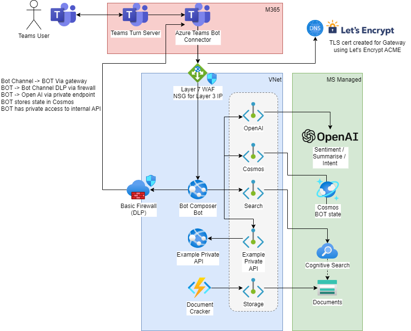
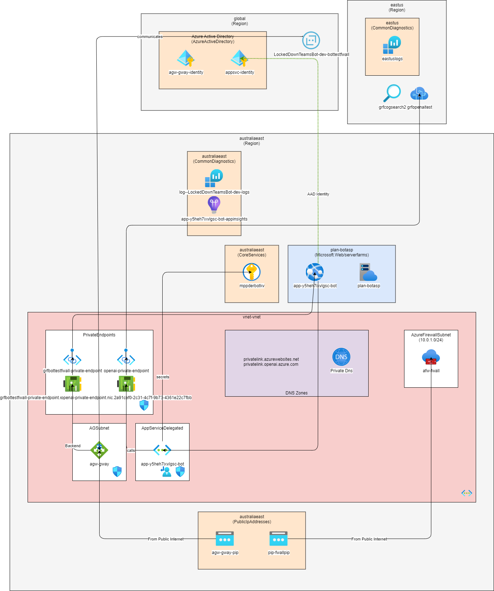

# Locked Down GPT Bots

A sample application showing a secure setup with

- Azure Open AI 
- Bot Composer Bot using Managed Identity
- Document Cracking function
- Vector search
- Open AI function calling

TLDR;
```bash
azd init -t graemefoster/LockedDownChatBot
azd up
```

To use a different location (**eastus** default) for a new OpenAI service
```bash
azd env set OPENAI_LOCATION <open-ai-location>
```

When you're ready to deploy:
```bash
azd up
```

# Learnings

- Use GPT3.5-Turbo >= 0613. This model has been trained on functions (see [here](https://platform.openai.com/docs/guides/gpt/function-calling))
- The function support is very loose.. The prompt appears pretty stable now, but I still see GPT get excited and add natural language every now and again!
- MS API doesn't support function calling via its API, but (this[https://codeconfessions.substack.com/p/creating-chatgpt-plugins-using-the]) looks useful 
- Bot Composer custom dialogues are really useful, but won't work in Power Virtual Assistants. However you could use a custom skill / logic app / external 

# Why?

As of July 2023 the Azure Open AI support is maturing, but it still missing a few features to enable some experiences:

## Access to Private data

We are seeing maturing of Azure Open AI through features like Bring Your Own Data. But as of July 2023, these do not enable you to make private network calls to your Data Sources. 

The current approach is to use Public accessible Data Sources.

## Integration with Bots

PVA support for Bots is maturing rapidly. But your options for accessing secure data involve deploying Power Data Gateways to your on-premises networks. This can be tricky for organisations with strict Security Zone models, who wish to enhance Bot experiences with secure data.

## Support for 'Functions'

Azure OpenAI does not support 'Functions' where you can explicitly ask OpenAI to comprehend an utterance, and output a very specific format response.

# What?

This repository provides templates and code to address each of the above capabilities.

## Access to Private Data

The sample runs a Bot Composer Bot inside your own network, where it can be zoned appropriately to access the data it requires.

## Integration with Bots

The sample sets up a Teams Channel which connects to your Bot via the Application Gateway

## TLS certificates

The sample uses LetsEncrypt to fetch TLS certificates to secure the Application Gateway

## Support for 'Functions'

Not 100%, but the sample shows some System Prompts that can get JSON output to assist with you calling Downstream APIs.

# How do I deploy this?

We support the Azure Developer CLI (azd). To get started you'll need a few things handy:

- DNS (a subzone will do, but to wire up the Application Gateway we need to provision a LetsEncrypt certificate)
- An OpenAI service. We don't deploy this (right now) so please bring your own.
- Optional AAD application for local testing. We use a Managed Identity in the cloud to auth your Bot, but this isn't possible from a local dev machine
- Optional AAD sign-in card. There's a dialogue to trigger a User-SignIn if you want to understand the flows.
  - Your application needs a redirect to https://token.botframework.com/.auth/web/redirect 

```bash
azd init -t graemefoster/LockedDownChatBot
azd up
```

The solution builds an Azure Architecture like this:




